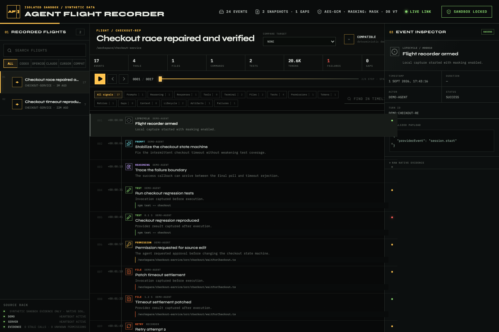
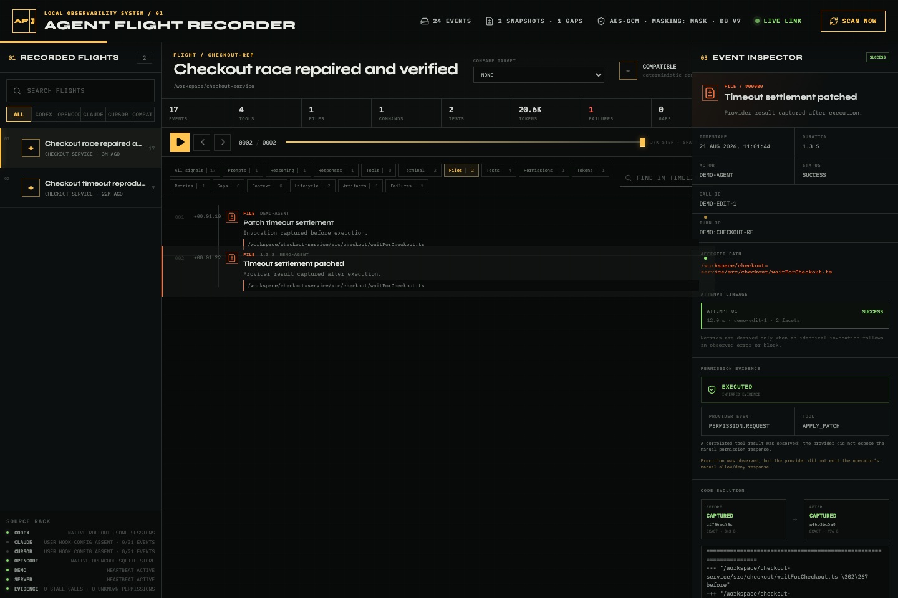
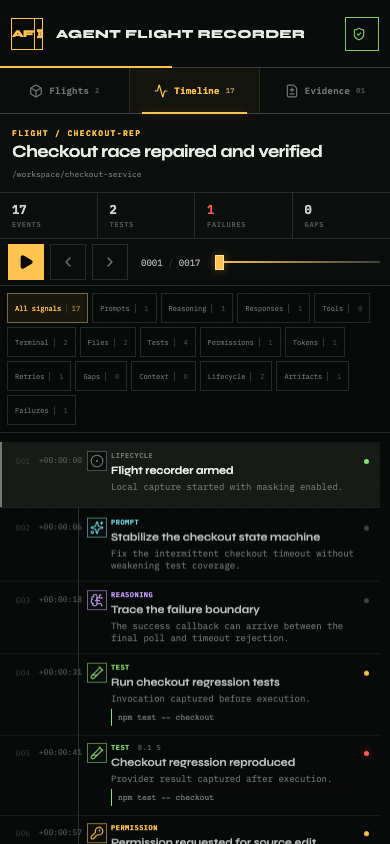

# Agent Flight Recorder

**Turn local AI coding-agent traces into an auditable replay of prompts, tool calls, edits, tests, retries, permissions, resource usage, failures, and code evolution—without sending the evidence to a cloud service.**

[](#requirements)
[](https://github.com/OthmaneBlial/Agent-Flight-Recorder/actions/workflows/ci.yml)
[](LICENSE)


[**Explore the live showcase and field manual →**](https://othmaneblial.github.io/Agent-Flight-Recorder/)



Agent Flight Recorder is a local black box for engineers who need to answer questions that chat history cannot: _What exactly ran? Which attempt failed? Was a permission result explicit or inferred? What changed on disk? What evidence is missing?_ It normalizes native provider evidence into an append-only SQLite timeline while preserving the raw source, provenance, and uncertainty behind every conclusion.

## Try the full product in two commands

The deterministic demo uses an isolated `.flight-recorder-demo` database, performs no native-source scan, requires no account or API key, and contains no personal data.

```bash
npm ci
npm run demo -- --reset
```

Open `http://127.0.0.1:4174`. Inspect the successful checkout repair, select **Files** to view an exact before/after diff, select **Tests** to follow failed and successful attempts, or compare it with the earlier failed flight. Use `J`/`K` or the arrow keys to step and `Space` to replay.

If port 4174 is occupied:

```bash
npm run demo -- --reset --port=4180
```

For frontend development, `npm run dev` is privacy-safe by default: it resets and seeds only the synthetic sandbox, blocks native scans and live hook ingestion, ignores an ambient `AFR_DATA_DIR`, and automatically selects a free loopback web/API port pair.

```bash
npm run dev
# Optional fixed ports:
npm run dev -- --web-port=5273 --api-port=5274
```

Real machine evidence is an explicit private mode and should never be used for public screenshots, streaming, or hosted demos:

```bash
npm run dev:private
```

## What makes it different

- **Evidence, not a reconstructed story.** Native envelopes are retained; unsupported provider signals stay null, unknown, or become explicit capture gaps.
- **Replay across agents.** Codex, OpenCode, Claude Code, Cursor, and compatible hooks share one operational event model without erasing provider-specific details.
- **Code evolution with assurance.** Content-addressed snapshots distinguish exact, best-effort, missing, skipped, and pruned boundaries.
- **Durable correlation.** Tool facets, outcomes, retries, permissions, and related file evidence survive restarts and portable bundle round trips.
- **Local by construction.** The service hard-binds to loopback, rejects untrusted Host/Origin values, emits no telemetry, and encrypts evidence-bearing columns at rest.
- **Honest scale.** List projections omit heavy payloads, timeline rows are virtualized, and native scans run outside the API process.

## The 30-second demo story

The included scenario records two comparable flights:

1. An earlier checkout test run reproduces a timeout and ends without trustworthy file boundaries.
2. A repair flight captures the prompt, root-cause reasoning, failed test, permission request, exact source edit, derived retry, successful test, static validation, resource meter, and final response.
3. The inspector shows retry lineage, an inferred execution outcome without fabricating manual approval, and an exact generated diff.

| Exact code evolution | Phone-sized replay |
| --- | --- |
|  |  |

Regenerate these privacy-safe images from the deterministic data with `npm run screenshots` after installing Playwright Chromium.

Before publishing, run `npm run privacy:check`. It rejects recorder databases, keys, `.afr` bundles, `.flight-recorder*` contents, and absolute user-home paths from the set of files Git would publish. `npm run verify` includes this gate.

## Supported evidence surfaces

| Provider | Capture surface | Current behavior |
| --- | --- | --- |
| Codex | `~/.codex/sessions/**/*.jsonl` | Incremental bounded reads, current and older runtime-item variants, reasoning payload preservation, tools, commands, patches, usage, collaboration, and explicit historical gaps. |
| OpenCode | Native SQLite database and WAL | Read-only session/message/part/tool/file/token/cost import with WAL-aware change detection. |
| Claude Code | Official command hooks | All 31 documented events normalized; exact file boundaries when a synchronous hook and safe workspace path permit them. |
| Cursor | Official native command hooks | All 21 documented native events normalized; completed thought blocks and detailed shell/file events preserved. |
| Compatible agents | `afr.event.v1` over stdin or loopback HTTP | Versioned permissive envelope with unknown fields retained. |

Provider contracts do not expose identical evidence. Claude Code does not expose hidden reasoning or complete general token/cost usage. Cursor has no dedicated universal token/cost event or native manual permission-result event. The recorder does not estimate or invent those fields.

## Requirements

- Node.js 24.18.1 or newer (`.nvmrc` and `.node-version` are included). This floor avoids the experimental `node:sqlite` runtime warning present in earlier releases.
- npm 11
- macOS, Linux, or Windows for the recorder; native-source discovery currently targets the standard Codex and OpenCode paths documented above
- Chromium only for browser tests and screenshot generation

No database server, cloud account, paid API, or agent credential is required.

## Record native local evidence

```bash
npm ci
npm run build
npm run scan -- --all
npm start
```

Open `http://127.0.0.1:4174`.

By default, the explicit private `serve` command discovers all Codex rollouts and the local OpenCode store every few seconds. Use `--no-scan` for a hook-only server; manual `POST /api/scan` and **SCAN NOW** remain available. The synthetic `demo` command has neither path.

```bash
npm start -- --no-scan
npm run scan -- --limit=12
npm run doctor
```

`npm run doctor` returns machine-readable source, storage, policy, heartbeat, snapshot, gap, pending-call, and permission health. Run `node build/server/cli.js --help` for the complete CLI. Help and version commands never initialize storage or start a server.

## Evidence policy and storage

New evidence is credential-masked by default. Known sensitive paths—including `.env`, Git metadata, credentials, private keys, certificates, and keystores—are never snapshotted. Choose `strict` to omit raw native envelopes or explicitly choose `off` when exact local evidence outweighs masking.

```bash
AFR_REDACTION_MODE=strict \
AFR_RAW_RETENTION_DAYS=30 \
AFR_SNAPSHOT_RETENTION_DAYS=90 \
AFR_SNAPSHOT_MAX_BYTES=2097152 \
npm start
```

Environment values are validated at startup. The project does not load `.env` files automatically; [`.env.example`](.env.example) is a reference for shell or service configuration.

Set `AFR_DATA_DIR` or pass `--data-dir=/absolute/path` to move the store. The default is `.flight-recorder/recorder.db`.

- On macOS, a path-scoped 256-bit storage key is stored in the login Keychain.
- `AFR_STORE_KEY` can supply an exact 32-byte hexadecimal or base64 key.
- Other platforms fall back to a private `recorder.db.key` file.
- The data directory is forced to `0700`, and database/WAL/key files to `0600`, on Unix.
- AES-256-GCM protects normalized payloads, native raw evidence, and snapshot blobs. Indexed timestamps, kinds, summaries, commands, paths, and correlations remain plaintext and are reported as such by the API.

Masking and column encryption do not make a recorder database safe to publish. It can still contain source code, prompts, command text, and identifiable metadata.

### Retention is dry-run-first

```bash
node build/server/cli.js prune --raw-older-than=30 --snapshots-older-than=90
node build/server/cli.js prune --raw-older-than=30 --snapshots-older-than=90 --apply
```

Raw retention removes native envelopes while keeping normalized timeline and correlation data. Snapshot retention removes old content blobs while preserving provenance marked `pruned`.

## Claude Code and Cursor hooks

Build first, then preview a complete native configuration fragment:

```bash
node build/server/cli.js config --provider=claude --data-dir="$PWD/.flight-recorder"
node build/server/cli.js config --provider=cursor --data-dir="$PWD/.flight-recorder"
```

The managed installer structurally merges existing JSON, deduplicates recorder handlers, and creates a timestamped backup. It changes nothing until `--apply` is present.

```bash
node build/server/cli.js install-hooks --provider=claude --scope=user --data-dir="$PWD/.flight-recorder"
node build/server/cli.js install-hooks --provider=claude --scope=user --data-dir="$PWD/.flight-recorder" --apply

node build/server/cli.js install-hooks --provider=cursor --scope=project --project-root="$PWD"
node build/server/cli.js install-hooks --provider=cursor --scope=project --project-root="$PWD" --apply
```

Uninstall removes only recorder-marked handlers. Rollback requires an explicit backup path and `--apply`.

```bash
node build/server/cli.js uninstall-hooks --provider=cursor --scope=user
node build/server/cli.js rollback-hooks --provider=cursor --scope=user --backup=/path/from/install-receipt --apply
```

Command-hook timeouts fail open so recorder failure does not block the coding agent. Hooks run with the local user's permissions; review generated commands before applying them.

## Compatible agent protocol

Post the [`afr.event.v1`](docs/compatible-event-v1.schema.json) envelope to the loopback server:

```bash
curl --fail --silent \
  -H 'content-type: application/json' \
  --data '{
    "schema":"afr.event.v1",
    "sessionId":"example-01",
    "event":"tool.before",
    "timestamp":"2026-08-21T09:00:00.000Z",
    "cwd":"/workspace/app",
    "toolName":"shell",
    "command":"npm test",
    "callId":"call-7"
  }' \
  http://127.0.0.1:4174/api/hooks/compatible/tool.before
```

Or capture the same JSON over stdin without a running server:

```bash
printf '%s' "$EVENT_JSON" | node build/server/cli.js hook \
  --provider=compatible \
  --data-dir="$PWD/.flight-recorder"
```

Unknown fields are preserved. Semantic event names include `prompt.submit`, `reasoning.complete`, `tool.before`, `tool.after`, `tool.failure`, `permission.request`, `file.changed`, `response.complete`, `session.start`, and `session.end`.

## Compare and carry flights

The console compares normalized metrics, event kinds, durations, failures, gaps, and affected files across providers. The same result is available from `GET /api/compare?left=SESSION_ID&right=SESSION_ID`.

Portable bundles include one detailed session and its referenced snapshot blobs. AES-256-GCM authentication, gzip compression, scrypt key derivation, and a per-bundle salt are the default.

```bash
export AFR_BUNDLE_PASSPHRASE='use-a-long-local-passphrase'
node build/server/cli.js export --session='codex:SESSION_ID' --out=./flight.afr
node build/server/cli.js import --in=./flight.afr --data-dir=./restored-recorder
```

Export refuses overwrite without `--force`; import refuses an existing session without `--merge`; unencrypted export requires `--unencrypted`. See [the bundle format](docs/flight-bundle-v1.md).

## Development and validation

```bash
npm run dev           # recorder :4174 + Vite :4173
npm run format        # apply Biome formatting
npm run lint          # static lint and accessibility rules
npm run check         # strict web and server TypeScript
npm test              # unit and integration tests
npm run build         # production CLI/server + console
npm run test:e2e      # desktop and phone Chromium flows
npm run verify        # format, lint, types, tests, build
npm audit --audit-level=moderate
```

Install the browser once when needed:

```bash
npx playwright install chromium
```

GitHub Actions runs verification, a production dependency audit, and Chromium E2E on Node 24.18.1. Action revisions are pinned to immutable commits, and Dependabot tracks npm and workflow updates.

### Repository map

```text
src/server/adapters/   native Codex and OpenCode ingestion
src/server/            storage, hooks, correlation, policy, bundles, HTTP, CLI
src/shared/            canonical public types
src/web/               replay console
tests/                 unit and integration contracts
tests/e2e/             primary browser journeys
docs/                  architecture, formats, audit, release, troubleshooting
research_provider_hooks/ provider-contract research notes
```

## Production behavior

`npm run build` emits the Node server/CLI to `build/` and the static console to `dist/`. `npm start` serves both from one loopback-only process. The server emits structured startup and internal-error logs, includes request IDs in API responses, returns a readiness/capture view from `/api/health`, and handles `SIGINT`/`SIGTERM` without leaving scanner children behind.

Docker is intentionally not included. The product's value depends on direct, read-only access to host agent stores, host filesystem snapshots, private file modes, and—on macOS—the login Keychain. A container would require broad host mounts and a separately managed storage key while providing little isolation benefit for a loopback desktop tool. Native Node startup is the supported production path.

## Architecture and trust boundaries

```text
native logs / provider hooks / compatible envelope
                         │
                         ▼
               provider adapters
                         │
                         ▼
             canonical append-only events
                  ╱               ╲
                 ▼                 ▼
       capture-gap ledger   content-addressed snapshots
                  ╲               ╱
                         ▼
          encrypted evidence columns / SQLite WAL
                         │
                         ▼
          loopback HTTP + SSE replay console
```

Read [the architecture](docs/ARCHITECTURE.md) for schema, correlation, migrations, API routes, and provider limits. Read [the security policy](SECURITY.md) before exposing or sharing any recorded artifact.

## Honest limitations

- Provider-private reasoning, non-emitted callbacks, and unavailable permission decisions cannot be reconstructed.
- Claude/Cursor runtime delivery must be validated on machines where those products and explicitly installed hooks are present.
- Full-page SQLCipher encryption is not provided; evidence-bearing columns are encrypted while indexed metadata stays plaintext.
- Parallel identical actions without provider call IDs can remain temporally ambiguous; every callback is retained and the nearest bounded match is labeled without overstating identity.
- The console is intentionally a single-user local tool. Remote access and multi-user authentication are outside its threat model.
- Native Codex/OpenCode discovery uses their standard local paths; custom provider locations currently require adapter or compatible-hook configuration.

## Project information

- [Contributing](CONTRIBUTING.md)
- [Security and privacy](SECURITY.md)
- [Troubleshooting](docs/TROUBLESHOOTING.md)
- [Changelog](CHANGELOG.md)
- [Release checklist](docs/RELEASE_CHECKLIST.md)
- [Code of Conduct](CODE_OF_CONDUCT.md)
- [MIT License](LICENSE)

The focused roadmap is to validate real Claude/Cursor callback delivery on opted-in installations, add adapter fixtures when provider contracts evolve, and package signed desktop launchers without weakening the local-only boundary.
